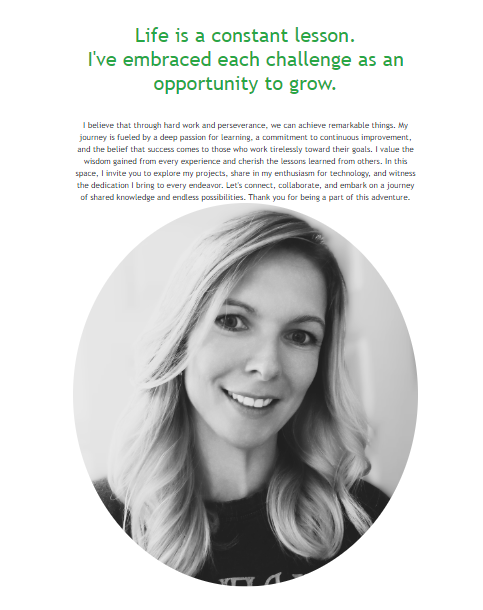
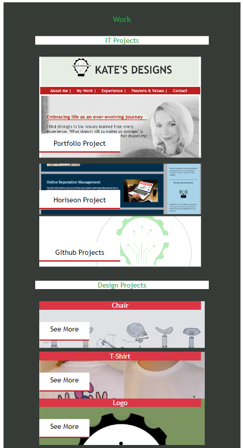

# Bootstrap-Portfolio

Welcome to my personal website! This website showcases various aspects of my life, including my adventures, projects, professional development, passions, and values. Feel free to explore the different sections and get to know more about me.

Table of Contents:

- Navigation
- Header
- About Me
- Work
--  IT Projects
--  Design Projects
- Experience
- Passion and Values
- Work Details
- Contact

1. Navigation

The navigation bar is fixed at the top of the page and includes the following elements:

- Logo
- Sections with dropdown menus
- Search button
The navbar is positioned fixed to ensure easy navigation throughout the site.

DESKTOP VIEW:

TABLET VIEW:

PHONE VIEW:

2. Header
The header features a captivating background image from one of my adventurous trips, along with my life motto.

DESKTOP VIEW:

TABLET VIEW:

PHONE VIEW:

3. About Me
This section provides a glimpse into my life, featuring a profile photo and a brief description of my life perspective.

DESKTOP VIEW:

TABLET VIEW:

PHONE VIEW:

4. Work
  IT Projects
  This section showcases projects developed during my bootcamp. Each image is a link to the respective project.

  Design Projects
  Highlighting some of my university design projects. Each image links to a detailed section with project information.

DESKTOP VIEW:

TABLET VIEW:

PHONE VIEW:

5. Experience
An overview of my professional development, presented chronologically with titles. Descriptions are currently in progress.

DESKTOP VIEW:

TABLET VIEW:

PHONE VIEW:

6. Passion and Values
Explore my diverse interests, such as painting, drawing, cooking, and more. Some sections include links to my Instagram account for a deeper look into my passions.

DESKTOP VIEW:

TABLET VIEW:

PHONE VIEW:

7. Work Details

DESKTOP VIEW:

   

TABLET VIEW:

PHONE VIEW:

8. Contact
This section include:
  Email
  Address
  Phone
  Social Media Links (Instagram, GitHub, LinkedIn)
*Currently under construction

DESKTOP VIEW:

TABLET VIEW:

PHONE VIEW:

Note: This portfolio is a work in progress, and I will continue to update it with more projects and experiences.

© 2023 Kate's Designs. All rights reserved.

